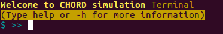
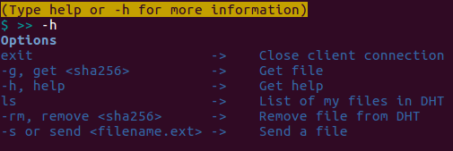

# Distributed Hash Table (CHORD)
Distributed Hash Table - CHORD Example

## Dependencies

### Python virtualEnv

* Install
```bash
apt-get install python-virtualenv
```

* Create Environment
```bash
mkdir env
virtualenv env
env/bin/pip install -r requirements.txt
```

### Python dependencies
* [ØMQ (ZeroMQ)](http://zeromq.org)
* [JSON](https://docs.python.org/2/library/json.html)
* [HashLib](https://docs.python.org/2/library/hashlib.html)
* [Termcolor](https://pypi.python.org/pypi/termcolor)

## Run

### node

First node
```bash
python node.py <my_ip>:<port>
```
Otherwise
```bash
python node.py <my_ip>:<port> <other_node_ip>:<port>
```

### client

```bash
python node.py <my_ip>:<port> <some_node_ring>:<port>
```

#### Client Options

